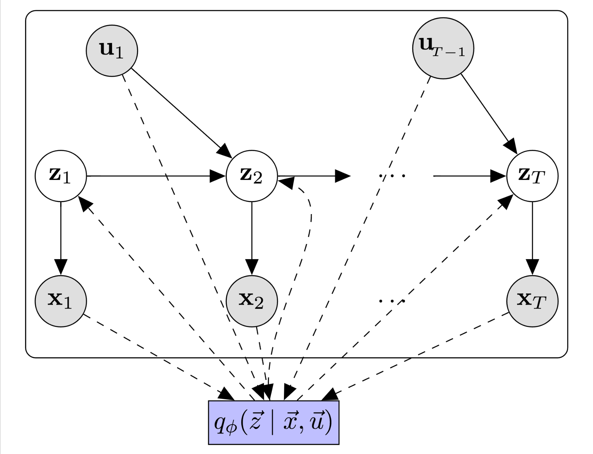
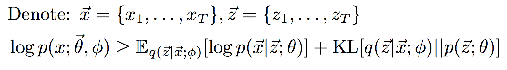

# structuredInf
Code to fully reproduce benchmark results (and to extend for your own purposes) from the paper:
<p align="center">Krishnan, Shalit, Sontag. <a href="https://arxiv.org/abs/1609.09869">Structured Inference Networks for Nonlinear State Space Models</a>, AAAI 2017.</p>
See <a href="https://github.com/clinicalml/dmm">here</a> for a simplified and easier to use version of the code.

## Goal
The goal of this package is to provide a black box inference algorithm for learning models of time-series data. 
Inference during learning and at test time is based on compiled recognition or [inference network.](https://arxiv.org/abs/1401.4082)

## Model
The figure below describes a simple model of time-series data.

This method is a good fit if: 
* You have an arbitrarily specified state space model whose parameters you're interested in fitting. 
* You would like to have a method for fast posterior inference at train and test time 
* Your temporal generative model has Gaussian latent variables (mean/variance can be a nonlinear function of previous timestep's variables).

<p align="center"></p>

The code uses variational inference during learning to maximize the likelihood of the observed data:
<p align="center"></p>

*Generative Model* 

* The latent variables z1...zT and the observations x1...xT describe the generative process for the data.
* The figure depicts a state space model for time-varying data. 
* The emission and transition functions may be pre-specified to have a fixed functional form, a parametric functional form, a function parameterized by a deep neural networks or some combination thereof. 

*Inference Model* 

The box q(z1..zT | x1...xT) represents the inference network. There are several supported inference networks within this package. 
* Inference implemented with a bi-directional LSTM
* Inference implemented with an LSTM conditioned on observations in the future
* Inference implemented with an LSTM conditioned on observations from the past

## Installation

### Requirements
This package has the following requirements:

python2.7

[Theano](https://github.com/Theano/Theano)
Used for automatic differentiations

[theanomodels] (https://github.com/clinicalml/theanomodels) 
Wrapper around theano that takes care of bookkeeping, saving/loading models etc. Clone the github repository
and add its location to the PYTHONPATH environment variable so that it is accessible by python.

[pykalman] (https://pykalman.github.io/) 
[Optional: For running baseline UKFs/KFs]

An NVIDIA GPU w/ atleast 6G of memory is recommended.

Once the requirements have been met, clone this repository and it's ready to run. 

### Folder Structure
The following folders contain code to reproduct the results reported in our paper:
* expt-synthetic, expt-polyphonic: Contains code and instructions for reproducing results from the paper.
* baselines/: Contains to run some of the baseline algorithms on the synthetic data
* ipynb/: Ipython notebooks for visualizing saved checkpoints and building plots

The main files of interest are:
* parse_args_dkf.py: Arguments that the model expects to be present. Looking through it is useful to understand the different knobs available to tune the model. 
* stinfmodel/dkf.py: Code to construct the inference and generative model. The code is commented to enable easy modification for different scenarios.
* stinfmodel/evaluate.py: Code to evaluate the Deep Kalman Filter's performance during learning.
* stinfmodel/learning.py: Code for performing stochastic gradient ascent in the Evidence Lower Bound. 

## Dataset

We use numpy tensors to store the datasets with binary numpy masks to allow batch sizes comprising sequences of variable length. We train the models using mini-batch gradient descent on negative ELBO. 

### Format 

The code to run on polyphonic and synthetic datasets has already been created in the theanomodels repository. See theanomodels/datasets/load.py for how the dataset is created and loaded. 

The datasets are stored in three dimensional numpy tensors. 
To deal with datapoints
of different lengths, we use numpy matrices comprised of binary masks. There may be different choices
to manipulate data that you may adopt depending on your needs and this is merely a guideline.

```
assert type(dataset) is dict,'Expecting dictionary'
dataset['train'] # N_train x T_train_max x dim_observation : training data
dataset['test']  # N_test  x T_test_max  x dim_observation : validation data
dataset['valid'] # N_valid x T_valid_max x dim_observation : test data
dataset['mask_train'] # N_train x T_train_max : training masks
dataset['mask_test']  # N_test  x T_test_max  : validation masks
dataset['mask_valid'] # N_valid x T_valid_max : test masks
dataset['data_type'] # real/binary
dataset['has_masks'] # true/false
```
During learning, we select a minibatch of these tensors to update the weights of the model. 

### Running on different datasets

**See the folder expt-template for an example of how to setup your data and run the code on your data**

## References: 
```
@inproceedings{krishnan2016structured,
  title={Structured Inference Networks for Nonlinear State Space Models},
  author={Krishnan, Rahul G and Shalit, Uri and Sontag, David},
  booktitle={AAAI},
  year={2017}
}
```
This paper subsumes the work in : [Deep Kalman Filters] (https://arxiv.org/abs/1511.05121)
